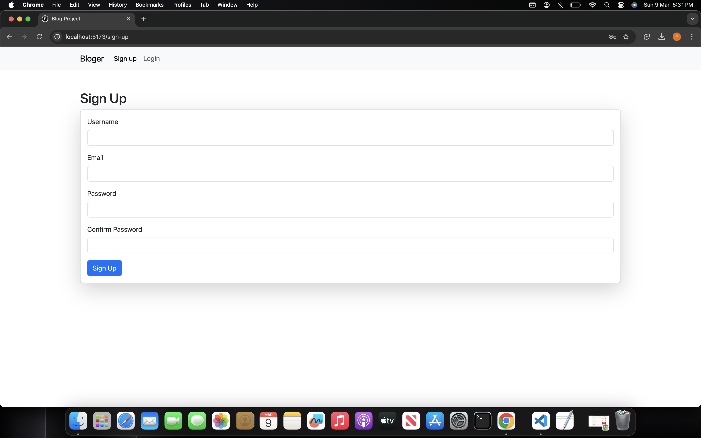

# Full Stack Django React Blog Application

This is a full stack web application built with Django for the backend and React for the frontend. The application includes user authentication, CRUD operations for blog posts, and JWT-based authentication.





## Requirements

- Python 3.7+
- Node.js
- npm or yarn
- Django
- Django REST framework
- React

## Backend Setup (Django)

1. **Clone the repository:**

```bash
git clone https://github.com/fatimarazzaq/full-stack-dj-react-blog/
cd full-stack-django-react-blog/backend